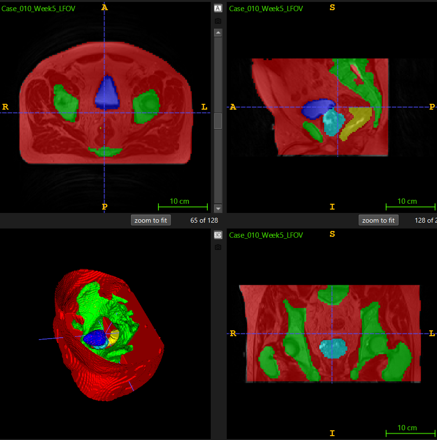
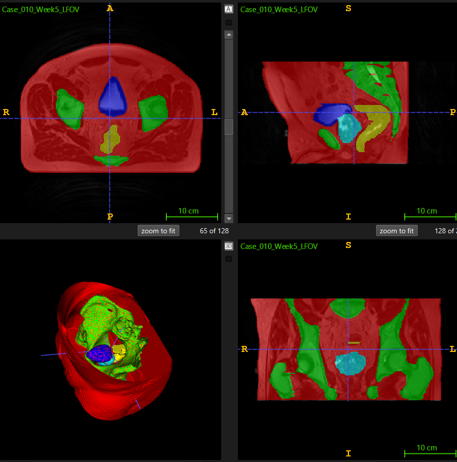
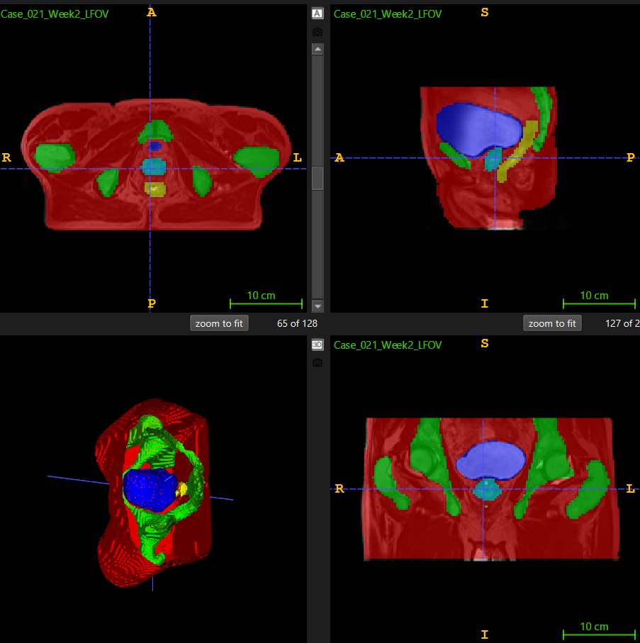
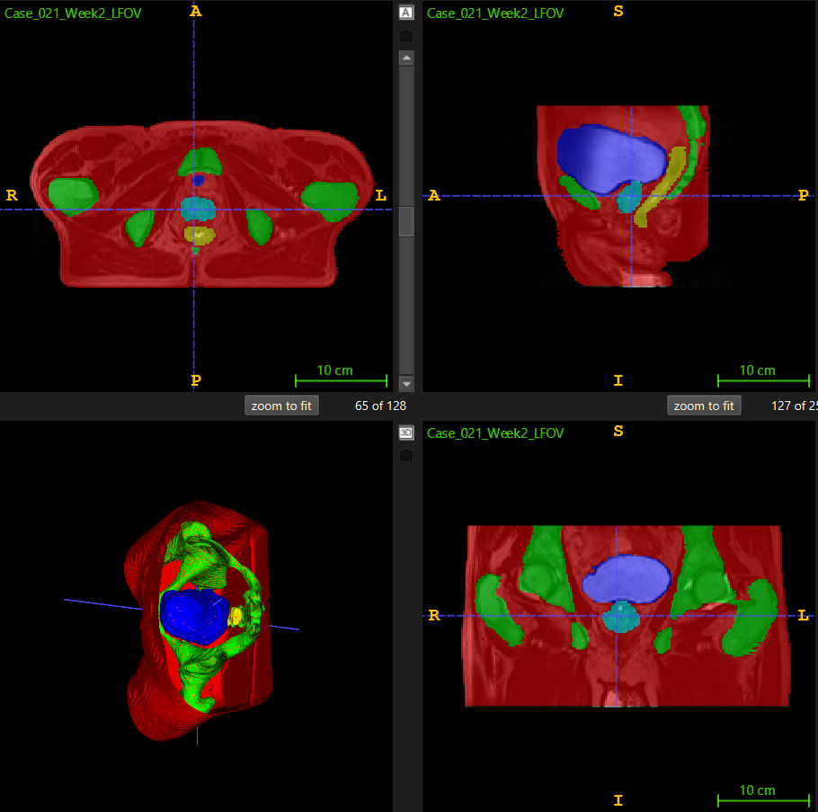

# Prostate 3D Dataset segmentation with improved 3D UNet

## Description  

This repository contains a data loading, training, and evaluation script for an improved 3D UNet meant to segment the CSIRO ["Labelled weekly MR images of the male pelvis"](https://data.csiro.au/collection/csiro:51392v2?redirected=true) dataset. These scripts create a model that is able to split a 3D MRI scan of a male pelvis into 6 classes, being background, body, bones, bladder, rectum, and prostate. The benefit of such a model is to quickly segment medical images and highlight the separate areas to speed up analysis and help make relevant decisions.

The general steps of the scripts as as such: the dataset script first runs the preprocess function, which loads each image, resamples it to the target shape of (128, 128, 64), one-hot encoding the labels as well, before converting them to tensors and saving them as .pt files. Then, the training script splits up the dataset based on patients into training and evaluation groups, then uses an improved UNet and a combined loss criterion of entropy and Dice loss to train the model for up to 30 epochs, saving a new model every time an improvement is observed. Finally, the predict script creates and saves prediction masks for a subset of images, then calculates the dice score for each and returns the average in order to validate the accuracy of the model. These images are also saved for manual validation.

### Usage
Run the scripts in the following order, allowing them to finish completely. These files must be in the same directory as `utils.py`, `modules.py`, and the `semantic_labels_anon` (labels) and `semantic_MRs_anon` (images) folders.  

`dataset.py`  
`train.py`  
`predict.py`  

`train.py` can be stopped prematurely when it has reached a satisfactory accuracy as it saves a new model every time a best Dice score is achieved.

### Inputs
The required input files match the format of the images and labels stored in the `HipMRI_study_complete_release_v1.zip` file. More precisely, it requires the files to be named in the scheme `Case_XXX_WeekX_LFOV.nii.gz` for images `Case_XXX_WeekX_SEMANTIC_LFOV.nii.gz` for labels. This is so the data loader can find the correct files, and so that the image and label files can be linked consistently by the evaluation script. However, the code can be modified to support other file naming schemes, with the primary recommendation being to retain the `Case_XXX` start for both images and labels.

### Outputs  
Running predict.py with a working `best_model.pth` file generated by `train.py` will result in the `/predictions` folder in the root directory of the python scripts being generated. This folder will contain prediction masks for the full set of dataset images. These masks can be viewed in a medical image viewer with NiFTi support like ITK-SNAP, which was used for the testing of this script.

#### Results
Below are sample outputs of the model trained for 30 epochs. The final achieved Dice coefficient was 0.92 overall (not including background), with the following individual values. 

Class 0: Average Dice = 0.9922, Std Dev = 0.0022
Class 1: Average Dice = 0.9786, Std Dev = 0.0043
Class 2: Average Dice = 0.9284, Std Dev = 0.0143
Class 3: Average Dice = 0.9367, Std Dev = 0.0411
Class 4: Average Dice = 0.8867, Std Dev = 0.0291
Class 5: Average Dice = 0.8866, Std Dev = 0.0402

|                | Prediction                            | Ground Truth Label |
|----------------|---------------------------------------|-------|
| Case 10 Week 5 |  |       |
| Case 21 Week 2 |  |  
  

The most notable differences are in areas of fine detail, like the shape of the spine in the first case.

### Pre-processing
Pre-processing is carried out inside the `dataset.py` file. Images and labels ***must*** be pre-processed before `train.py` can be ran. This pre-processing converts the nii.gz format images and labels into PyTorch Tensor .pt files and downsamples them. This has speed advantages when doing more than a single run of `train.py` due to removing the need to process the files while training. This pre-processing also downsamples images by a scale of 0.5, which helps with memory requirements and significantly speeds up training (this can be removed for improved model resolution on higher VRAM GPUs).

The data is split by patient at the training stage into training and validation sets. This is in an effort to prevent overfitting, as randomly splitting the images would have the model train on all patients in the dataset. With this approach, it never sees *any* scans for a few chosen patients, avoiding overfitting.

### Requirements to run this project via pipreqs:  
nibabel==5.3.2  
numpy==2.3.4  
scipy==1.16.3  
torch==2.8.0  
tqdm==4.67.1  

#### Note:  
This project has been developed and tested using exclusively the dataset files in `HipMRI_study_complete_release_v1.zip`. It working for other datasets with renamed files cannot be guaranteed due to differences in the dimensions and number of classes in the ground truth labels, however the model is reusable.
